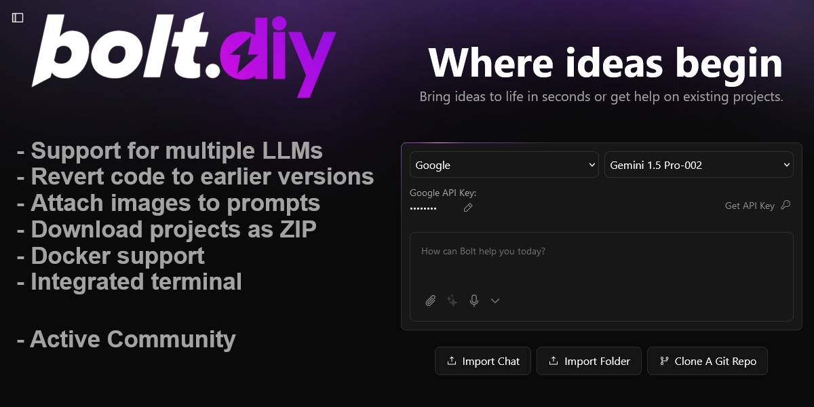

<div align="center">

# ⚡ HEDES STUDIO ⚡
### Autonomous Multi-Agent AI Development Studio & 100-Bot Hive Mind

[](https://www.typescriptlang.org/)
[](https://remix.run/)
[](https://tailwindcss.com/)
[](LICENSE)
[](#creators--core-contributors)

<br />



<br />
<br />

**Hedes Studio** is a next-generation, local-first autonomous AI development platform engineered and built by **Aditya Routh** and **AI**. It fuses high-speed LLM code generation, multi-agent hive-mind consensus, multimodal computer vision analytics, deep error diagnostics with automated self-healing, and seamless multi-ecosystem project scaffolding (Flutter, Dart, Python, Web, React, and more).

</div>

---

## 🌟 Key Highlights & Innovations

### 🧠 1. 100-Bot Hive-Mind Swarm Mode
- Activate the **SWARM** engine to engage an autonomous multi-agent consensus network.
- Specialized agents (Architect, Security Auditor, Frontend Specialist, Backend Engineer, QA Verifier) debate and refine solutions concurrently before generating production-grade code.
- Eliminates hallucinations through cross-agent validation and peer code review.

### 👁️ 2. Multimodal Photo & UI Vision Analytics
- Drop wireframes, sketch photos, Figma designs, or paste clipboard screenshots (<kbd>Ctrl+V</kbd>) directly into the chat prompt.
- Vision AI analyzes spacing, color palettes, typography, layout hierarchies, and component bounds to turn raw images into pixel-perfect, functioning code.

### ⚡ 3. Autonomous "⚡ Auto-Fix" Self-Healing
- Real-time diagnostic loop constantly monitors compiler logs, runtime exceptions, and terminal errors.
- One-click **Auto-Fix** analyzes error traces, identifies root-cause broken dependencies or syntax bugs, and rewrites the offending files automatically.

### 📱 4. Universal Multi-Ecosystem Scaffolder
- **Flutter & Dart**: Scaffolds Material 3 mobile apps complete with `pubspec.yaml`, clean state management, modular widget trees, and automatic mobile viewport framing.
- **Python & FastAPI**: Generates modular backends with REST endpoints, Pydantic schemas, and virtual environment setup.
- **Modern Web**: Vite, React, Remix, Next.js, and Tailwind CSS with slick Aurora glassmorphic styling and instant hot reload.

### 🐙 5. 1-Click Instant GitHub Repository Import
- Shallow-clone any public GitHub repo directly into your local workspace.
- Indexes the entire file tree in real-time, displays code in the Monaco/CodeMirror editor, and prompts the assistant to analyze dependencies and suggest launch scripts.

### 🔄 6. Continuous Auto-Save & Unified Project Persistence
- Zero data loss: every keystroke and project iteration is backed up continuously to local disk (`projects/`) and synced with IndexedDB.
- Seamlessly transition between multiple projects in the History drawer with full file tree restoration.

### 🎨 7. Aurora Glassmorphic Responsive Interface
- Ultra-modern dark aesthetic featuring curved glass panels, neon emerald focus rings, and an integrated bottom-right send deck.
- Fully responsive on any viewport width from mobile viewports to ultra-wide displays with horizontal scrolling action tracks.

---

## 🏗️ Architecture Overview

```
                          ┌───────────────────────────┐
                          │   Hedes Studio Web Deck   │
                          │ (Remix + Vite + Tailwind) │
                          └─────────────┬─────────────┘
                                        │
           ┌────────────────────────────┼────────────────────────────┐
           │                            │                            │
           ▼                            ▼                            ▼
┌──────────────────────┐    ┌──────────────────────┐    ┌──────────────────────┐
│  Prompt Architecture │    │  100-Agent Hive-Mind │    │ Multimodal Vision    │
│  & Context Engine    │    │  Swarm Consensus Net │    │ Screenshot Analyzer  │
└──────────┬───────────┘    └──────────┬───────────┘    └──────────┬───────────┘
           │                           │                           │
           └───────────────────────────┼───────────────────────────┘
                                       │
                                       ▼
                       ┌──────────────────────────────┐
                       │ Local Workspace File Manager │
                       │    (projects/<chatId>/)      │
                       └───────────────┬──────────────┘
                                       │
            ┌──────────────────────────┴──────────────────────────┐
            ▼                                                     ▼
┌──────────────────────┐                              ┌──────────────────────┐
│  CodeMirror Editor   │                              │ Live Preview Frame   │
│ & File Tree Explorer │                              │ (Web / Mobile Mode)  │
└──────────────────────┘                              └──────────────────────┘
```

---

## 🚀 Quick Start Guide

### Prerequisites
- **Node.js**: Version `18.18.0` or higher (Node 20+ recommended)
- **Git**: Installed and available in your system `PATH`
- **pnpm** or **npm**

### Installation

1. **Clone the repository**:
   ```bash
   git clone https://github.com/adiiiii13/hedes.git
   cd hedes
   ```

2. **Install dependencies**:
   ```bash
   npm install
   # or
   pnpm install
   ```

3. **Configure Environment**:
   Copy the example environment template and add your desired AI provider keys (optional; keys can also be configured directly via the in-app Settings UI):
   ```bash
   cp .env.example .env
   ```

4. **Launch the Development Server**:
   ```bash
   npm run dev
   ```
   Open [http://localhost:5174](http://localhost:5174) in your browser.

---

## ⌨️ Productivity Shortcuts & Quick Actions

| Command / Action | Functionality |
| :--- | :--- |
| <kbd>Enter</kbd> | Send prompt to AI |
| <kbd>Shift</kbd> + <kbd>Enter</kbd> | Insert newline in prompt textarea |
| <kbd>Ctrl</kbd> + <kbd>V</kbd> | Paste screenshot from clipboard for Multimodal Vision |
| `⚡ /fix` | Trigger autonomous diagnostic scan & error repair |
| `🎯 /flutter` | Scaffold a complete Flutter mobile application |
| `🌐 /web` | Scaffold a modern fullstack web application |
| `🐍 /python` | Scaffold a Python / FastAPI application |
| `/component` | Generate a modular, styled UI component |
| `/refactor` | Optimize codebase structure and eliminate technical debt |

---

## 🤖 Supported Model Providers

Hedes Studio connects out-of-the-box with all leading AI providers, as well as local offline models:

- **Google Gemini** (Gemini 1.5 Pro, Gemini 1.5 Flash, Gemini 2.0 Flash)
- **Anthropic Claude** (Claude 3.5 Sonnet, Claude 3 Opus, Claude 3 Haiku)
- **OpenAI** (GPT-4o, GPT-4o-mini, o1, o3-mini)
- **DeepSeek** (DeepSeek V3, DeepSeek R1 Reasoning)
- **Groq** (Ultra-low latency Llama 3.3 70B, Mixtral)
- **Local Ollama** (Run models 100% locally and offline: Llama 3, Qwen 2.5, DeepSeek-Coder)
- **OpenRouter, Together AI, Mistral, xAI Grok**

---

## 👤 Creators & Core Contributors

This project is completely designed, engineered, and built by:

- **Aditya Routh** ([@adiiiii13](https://github.com/adiiiii13))
- **AI** (Autonomous AI Engineering Partner)

**Repository**: [https://github.com/adiiiii13/hedes](https://github.com/adiiiii13/hedes)

---

## 📜 License

Distributed under the MIT License. See [LICENSE](LICENSE) for more details.
